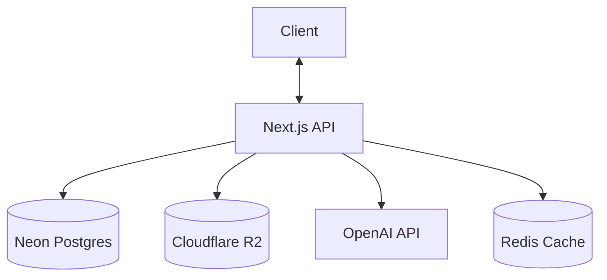
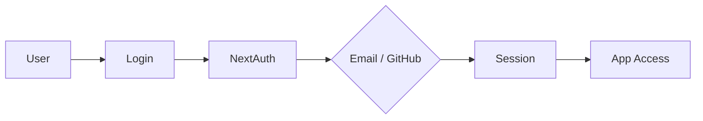
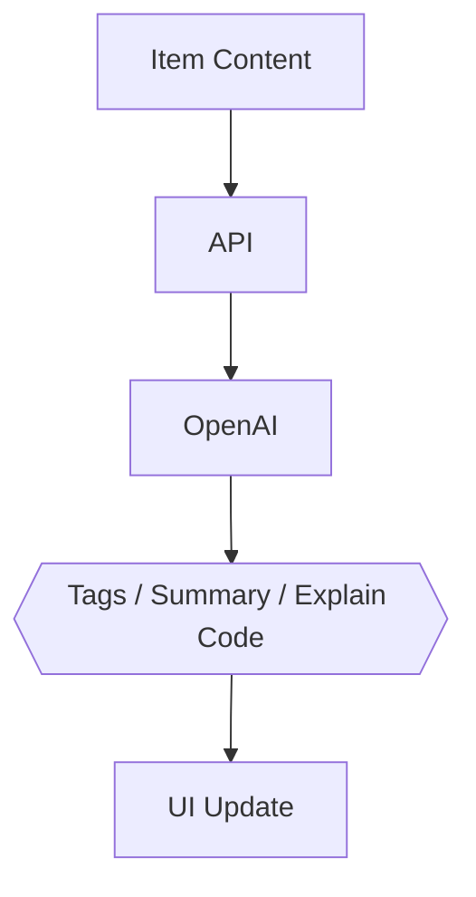

# 🚀 DevStash — Project Overview

> **Store Smarter. Build Faster.**
> A centralized, AI-enhanced knowledge hub for code snippets, prompts, docs, commands, links, and files.

**Status:** 🟡 In planning — ready for environment setup & UI scaffolding

---

## 📑 Table of Contents

1. [Problem](#-problem)
2. [Target Users](#-target-users)
3. [Core Features](#-core-features)
4. [Data Model](#️-data-model-prisma)
5. [Tech Stack](#-tech-stack)
6. [Monetization](#-monetization)
7. [UI / UX](#-ui--ux)
8. [Architecture & Flows](#-architecture--flows)
9. [Development Workflow](#️-development-workflow-course)
10. [Roadmap](#-roadmap)
11. [Open Questions & Review Notes](#-open-questions--review-notes)

---

## 🎯 Problem

Developers keep their essentials scattered across too many places:

| Where it lives now | What it is |
| --- | --- |
| VS Code / Notion | Code snippets |
| AI chat histories | Prompts |
| Buried project folders | Context files |
| Browser bookmarks | Useful links |
| Random folders | Docs |
| `.txt` files & bash history | Commands |
| GitHub gists | Project templates |

This causes **context switching**, **lost knowledge**, and **inconsistent workflows**.

➡️ **DevStash unifies all of it into ONE searchable, AI-enhanced hub.**

---

## 👥 Target Users

| Persona | Core Need |
| --- | --- |
| 🧑‍💻 Everyday Developer | Quick access to snippets, commands, links |
| 🤖 AI-First Developer | Store prompts, workflows, and contexts |
| 🎓 Content Creator / Educator | Save course notes and reusable code |
| 🏗️ Full-Stack Builder | Patterns, boilerplates, API references |

---

## ✨ Core Features

### A) Items & Item Types

Every saved entry is an **Item** belonging to a type. Built-in system types:

`📄 Snippet` · `💬 Prompt` · `📝 Note` · `⌨️ Command` · `📎 File` · `🖼️ Image` · `🔗 URL`

> Custom item types are available to **Pro** users.

### B) Collections

Group items into named collections — **mixed item types allowed**.
_Examples: React Patterns · Context Files · Python Snippets_

### C) Search 🔍

Full-text search across **content, titles, tags, and types**.

### D) Authentication 🔐

- Email + Password
- GitHub OAuth

### E) Quality-of-Life

- ⭐ Favorites & 📌 pinned items
- 🕘 Recently used
- 📥 Import from files
- ✍️ Markdown editor for text items
- 📤 File uploads (images, docs, templates)
- 💾 Export (JSON / ZIP)
- 🌙 Dark mode (default)

### F) AI Superpowers 🧠

- 🏷️ Auto-tagging
- 📋 AI summaries
- 💡 Explain Code
- 🎯 Prompt optimization

> Powered by **OpenAI `gpt-5-nano`** _(verify exact model identifier before integration — see [Open Questions](#-open-questions--review-notes))._

---

## 🗄️ Data Model (Prisma)

> ⚠️ **Schema Changes from original draft** — review these before adopting:
> 1. **Added NextAuth v5 models** (`Account`, `Session`, `VerificationToken`) + `emailVerified` / `image` on `User`. The Prisma adapter requires these or GitHub OAuth won't persist.
> 2. **Added `@@unique` constraints** on `Tag(userId, name)` and `ItemType(userId, name)` to prevent per-user duplicates.
> 3. **Added indexes** on all foreign keys (`userId`, `collectionId`, `typeId`) — Postgres does not auto-index FKs, and nearly every query filters by `userId`.
> 4. **Added `onDelete` rules** so deletions cascade/null cleanly instead of throwing FK errors.
> 5. **Promoted `contentType` to an enum** (`ContentType`) for type safety.

```prisma
// ---------- Enums ----------
enum ContentType {
  text
  file
}

// ---------- Auth & User ----------
model User {
  id                   String    @id @default(cuid())
  email                String    @unique
  emailVerified        DateTime?
  image                String?
  password             String?   // null for OAuth-only users
  isPro                Boolean   @default(false)
  stripeCustomerId     String?
  stripeSubscriptionId String?

  accounts     Account[]
  sessions     Session[]
  items        Item[]
  itemTypes    ItemType[]
  collections  Collection[]
  tags         Tag[]

  createdAt DateTime @default(now())
  updatedAt DateTime @updatedAt
}

// NextAuth v5 (Auth.js) Prisma adapter models
model Account {
  id                String  @id @default(cuid())
  userId            String
  type              String
  provider          String
  providerAccountId String
  refresh_token     String?
  access_token      String?
  expires_at        Int?
  token_type        String?
  scope             String?
  id_token          String?
  session_state     String?

  user User @relation(fields: [userId], references: [id], onDelete: Cascade)

  @@unique([provider, providerAccountId])
  @@index([userId])
}

model Session {
  id           String   @id @default(cuid())
  sessionToken String   @unique
  userId       String
  expires      DateTime

  user User @relation(fields: [userId], references: [id], onDelete: Cascade)

  @@index([userId])
}

model VerificationToken {
  identifier String
  token      String
  expires    DateTime

  @@unique([identifier, token])
}

// ---------- Domain ----------
model Item {
  id          String      @id @default(cuid())
  title       String
  contentType ContentType @default(text)
  content     String?     // used for text types
  fileUrl     String?
  fileName    String?
  fileSize    Int?
  url         String?
  description String?
  language    String?
  isFavorite  Boolean     @default(false)
  isPinned    Boolean     @default(false)

  userId String
  user   User   @relation(fields: [userId], references: [id], onDelete: Cascade)

  typeId String
  type   ItemType @relation(fields: [typeId], references: [id])

  collectionId String?
  collection   Collection? @relation(fields: [collectionId], references: [id], onDelete: SetNull)

  tags ItemTag[]

  createdAt DateTime @default(now())
  updatedAt DateTime @updatedAt

  @@index([userId])
  @@index([collectionId])
  @@index([typeId])
}

model ItemType {
  id       String  @id @default(cuid())
  name     String
  icon     String?
  color    String?
  isSystem Boolean @default(false)

  userId String?
  user   User?   @relation(fields: [userId], references: [id], onDelete: Cascade)

  items Item[]

  @@unique([userId, name])
  @@index([userId])
}

model Collection {
  id          String  @id @default(cuid())
  name        String
  description String?
  isFavorite  Boolean @default(false)

  userId String
  user   User   @relation(fields: [userId], references: [id], onDelete: Cascade)

  items     Item[]
  createdAt DateTime @default(now())
  updatedAt DateTime @updatedAt

  @@index([userId])
}

model Tag {
  id     String @id @default(cuid())
  name   String
  userId String
  user   User   @relation(fields: [userId], references: [id], onDelete: Cascade)

  items ItemTag[]

  @@unique([userId, name])
  @@index([userId])
}

model ItemTag {
  itemId String
  tagId  String

  item Item @relation(fields: [itemId], references: [id], onDelete: Cascade)
  tag  Tag  @relation(fields: [tagId], references: [id], onDelete: Cascade)

  @@id([itemId, tagId])
  @@index([tagId])
}
```

---

## 🧱 Tech Stack

| Category | Choice |
| --- | --- |
| Framework | **Next.js (React 19)** |
| Language | TypeScript |
| Database | [Neon](https://neon.tech) PostgreSQL + [Prisma ORM](https://www.prisma.io) |
| Caching | Redis _(optional)_ |
| File Storage | [Cloudflare R2](https://developers.cloudflare.com/r2/) |
| CSS / UI | [Tailwind CSS v4](https://tailwindcss.com) + [shadcn/ui](https://ui.shadcn.com) |
| Auth | [NextAuth v5 / Auth.js](https://authjs.dev) (email + GitHub) |
| AI | [OpenAI](https://platform.openai.com/docs/models) `gpt-5-nano` |
| Payments | [Stripe](https://stripe.com) (subscriptions + webhooks) |
| Deployment | [Vercel](https://vercel.com) _(likely)_ |
| Monitoring | [Sentry](https://sentry.io) _(later)_ |

---

## 💰 Monetization

| Plan | Price | Limits | Features |
| --- | --- | --- | --- |
| **Free** | $0 | 50 items · 3 collections | Basic search, image uploads, **no AI** |
| **Pro** | $8/mo or $72/yr | Unlimited | File uploads, custom types, AI features, export |

> Stripe handles subscriptions; **webhooks** sync subscription state back to the `User` record (`isPro`, `stripeSubscriptionId`).

---

## 🎨 UI / UX

- 🌙 **Dark mode first**
- Minimal, developer-friendly aesthetic
- Syntax highlighting for code
- Inspired by **Notion · Linear · Raycast**

## Design References 
- [Notion](https://notion.so)
- clean organization
- [Linear](https://linear.app)
- Modern dev aesthetic
- [Raycast](https://raycast.com) - Quick access patterns

### Screenshots 
refer to the screenshots below as a base for the dashboard UI. It does not have to be exact. Use it as a reference:


- @context/screenshots/dashboard-ui-drawer.png
- @context/screenshots/dashboard-ui-main.png


### Layout

- **Collapsible sidebar** — filters & collections
- Main grid/list workspace
- Full-screen item editor

### Responsive

- Mobile drawer for the sidebar
- Touch-optimized icons and buttons

---

## 🔌 Architecture & Flows

### API Architecture



### Auth Flow



### AI Feature Flow



---

## 🛠️ Development Workflow (Course)

- 🌿 **One branch per lesson** so students can follow and compare
- Use **Cursor / Claude Code / ChatGPT** for assistance
- **Sentry** for runtime monitoring & error tracking
- **GitHub Actions** _(optional)_ for CI

```bash
git switch -c lesson-01-setup
```

---

## 🧭 Roadmap

### ✅ MVP

- Items CRUD
- Collections
- Search
- Basic tags
- Free-tier limits

### 🚀 Pro Phase

- AI features
- Custom item types
- File uploads
- Export
- Billing & upgrade flow

### 🔮 Future Enhancements

- Shared collections
- Team / Org plans
- VS Code extension
- Browser extension
- Public API + CLI tool

---

## ❓ Open Questions & Review Notes

These are worth resolving before or during build — flagged honestly rather than buried:

1. **AI model identifier.** `gpt-5-nano` — confirm the exact current model string and availability in OpenAI's docs before wiring it up. Model names and tiers change; don't hardcode against a name you haven't verified.
2. **Free-tier limit enforcement.** Limits (50 items / 3 collections) need enforcement at the API layer, not just the UI. Decide whether to count in-app on each create, or store a cached count on `User`.
3. **R2 upload path.** Direct-to-R2 via presigned URLs (keeps large files off your serverless functions) vs. proxying through the API. Presigned is the better default for a file-heavy app on Vercel's payload limits.
4. **Search backend.** Postgres full-text (`tsvector`) is fine for MVP. If search quality/scale becomes a concern, revisit before reaching for a dedicated engine. Decide early so you can add the right indexes/columns.
5. **`fileSize` type.** `Int` caps at ~2 GB. Fine for snippets/docs, but if you ever allow large templates, switch to `BigInt`.
6. **Credentials + NextAuth v5.** The Credentials provider in Auth.js v5 only supports JWT sessions, while the Prisma adapter implies database sessions — confirm your session strategy so email/password and OAuth coexist cleanly.
7. **Tag/type ownership for system types.** System `ItemType`s have `userId = null`. Confirm the `@@unique([userId, name])` behavior with nulls matches your intent (Postgres treats nulls as distinct, so multiple null-user types with the same name are technically allowed — you may want a partial unique index for system types).

---

🏗️ **DevStash — Store Smarter. Build Faster.**
